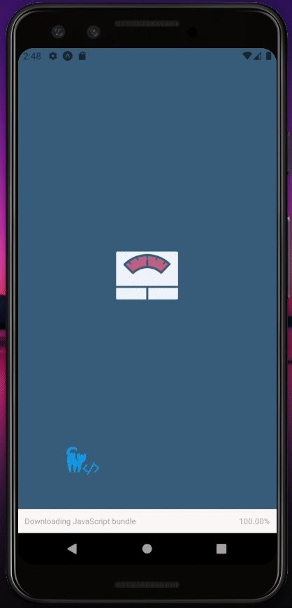

  

<h1 align="center" >
And Ma Weight?
</h1>

<strong>
A React Native static app to calculate the BMI!
</strong>

This aplication has made for train typescript and React antive features</a>

  <a aria-label="Typescript" href="https://github.com/facebook/react/blob/master/CHANGELOG.md#16120-november-14-2019">
    </img>
  </a>
  <a aria-label="React Version" href="https://github.com/facebook/react-native">
    </img>
  </a>

